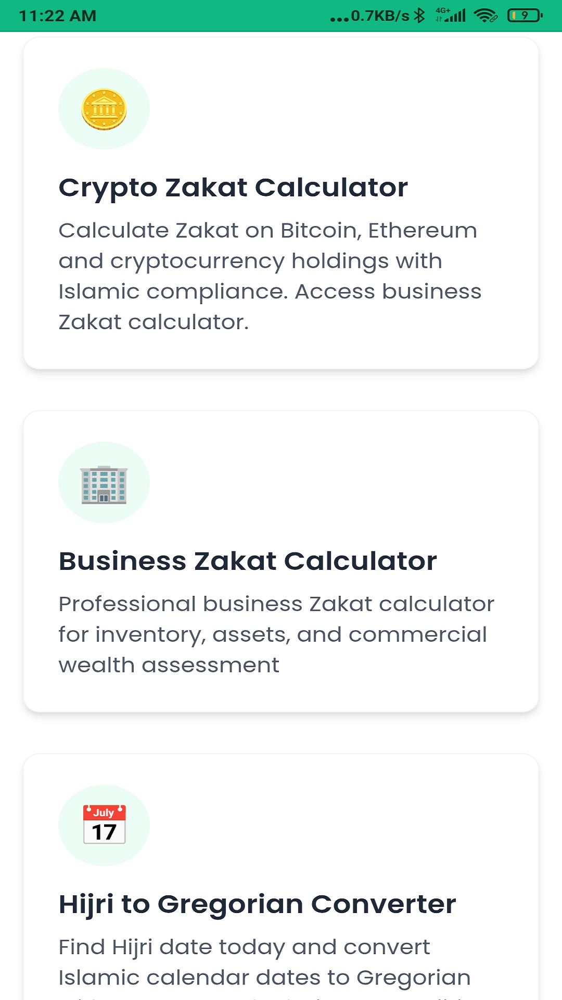
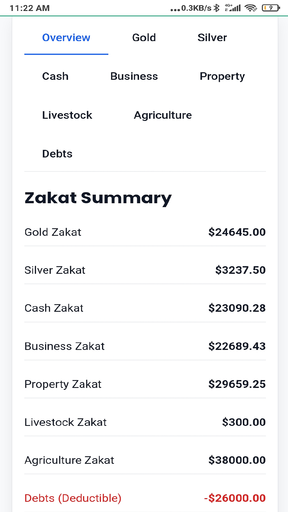
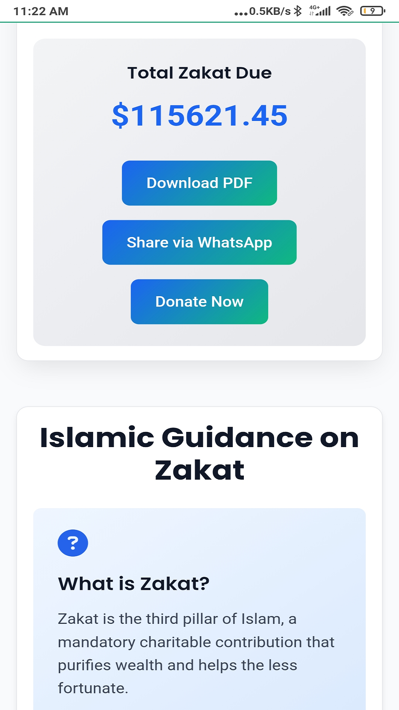

# 📱 Zakat App

An Islamic Zakat Calculator App to make Zakat calculation simple, fast, and accessible for everyone.

---

## ✨ Features
- 🕌 Calculate Zakat on gold, silver, and cash  
- 📊 Clear breakdown of amounts  
- ⚡ Works offline  
- 🎨 Simple and easy-to-use design  
- ✅ Based on Islamic principles  

---

## 📥 Download
👉 [Download Zakat App APK](https://github.com/aijaz-cell/zakat-app/releases/latest/download/app-release.apk)

---

## 🚀 Installation
1. Download the APK from the link above.  
2. Install it on your Android device.  
3. Open the app and start calculating your Zakat.  

---

## 📸 Preview

Here are some screenshots of the Zakat App:

  
  
  
  
  
  
  

---

## 📜 License
This project is licensed under the MIT License – see the LICENSE file for details.
